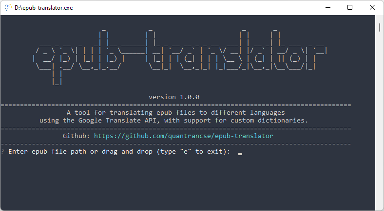

![Python Version][python-shield]
[![MIT License][license-shield]][license-url]

<br />
<p align="center">
    </img>

  <h2 align="center">epub-translator</h2>

  <p align="center">
    A tool for translating epub files to different languages using the Google Translate API, with support for custom dictionaries.
    <br />
    <br />
    <a href="https://github.com/quantrancse/epub-translator/releases/download/v1.0.0/epub-translator.exe">Download</a>
    ·
    <a href="#screenshots">Screenshots</a>
    ·
    <a href="#script-usage">Script Usage</a>
  </p>
</p>

<!-- TABLE OF CONTENTS -->
## Table of Contents

- [Table of Contents](#table-of-contents)
- [About The Project](#about-the-project)
  - [Features](#features)
- [Getting Started](#getting-started)
  - [Custom Dictionary Usage](#custom-dictionary-usage)
  - [Prerequisites](#prerequisites)
    - [Script Usage](#script-usage)
  - [Notes](#notes)
- [Screenshots](#screenshots)
- [Issues](#issues)
- [Contributing](#contributing)
- [License](#license)
- [Contact](#contact)

<!-- ABOUT THE PROJECT -->
## About The Project

A tool for translating epub files to different languages using the Google Translate API, with support for custom dictionaries.

### Features
* Autodetect source languages and support multiple destination languages.
* Keeping the structure of the original epub file (images, table of contents, text style,...)
* Support custom translation dictionaries (after translated).
* Support multiprocessing to speed up.
* Auto checking the new tool version.

<!-- GETTING STARTED -->
## Getting Started

Download the execution file below. Run and follow the instructions.

**Windows**: [epub-translator.exe ~ 12MB](https://github.com/quantrancse/epub-translator/releases/download/v1.0.0/epub-translator.exe)

### Custom Dictionary Usage
The custom dictionary will replace the original translated text by Google Translate with your own text.
* The custom dictionary is a `.txt` file with line by line in the format:  
`[original_translated_text]:[your_translated_text]`
* Text is case sensitive with special characters (except colon) and spaces are are allowed, separated from the other by the single colon `:`.

### Prerequisites

* python3
* google_trans_new
* requests
* bs4
* tqdm
```sh
pip install google_trans_new requests bs4 tqdm
```
**Important**
* To deal with the `json.decoder.JSONDecodeError`: https://github.com/lushan88a/google_trans_new/issues/36


#### Script Usage

```text
usage: epub-translator.py [-h] [-v] [-l dest_lang] [-d dict_path] epub_file_path

A tool for translating epub files to different languages 
using the Google Translate API, with support for custom dictionaries.

positional arguments:
  epub_file_path        path to the epub file

optional arguments:
  -h, --help            show this help message and exit
  -v, --version         show program's version number and exit
  -l dest_lang, --lang dest_lang
                        destination language
  -d dict_path, --dict dict_path
                        path to the translation dictionary
```
### Notes
* The translated epub file will be named `[original_file]_translated.epub` and located in the same folder as the original epub file.
* Suported destination languages are shown in `LANGUAGES` variable in the `epub-translator.py` file.
* This tool uses autodetect source languages when translating. If you have a problem with it, contact me and maybe I will add the manual select source languages.

## Screenshots


<!-- ISSUES -->
## Issues

* I only tested the tool on some of my favorite books and light novels. 
* This tool may be buggy. Some books may crash with complex epub structure or some of the text will not be translated.
* Sometimes, too many translation requests to the Google Translate API may cause Google to ban your IP from getting its translation service shortly. If this happens, you should change your IP via VPN.

<!-- CONTRIBUTING -->
## Contributing

Contributions are what make the open source community such an amazing place to be learn, inspire, and create. Any contributions you make are **greatly appreciated**.

1. Fork the Project
2. Create your Feature Branch (`git checkout -b feature/AmazingFeature`)
3. Commit your Changes (`git commit -m 'Add some AmazingFeature'`)
4. Push to the Branch (`git push origin feature/AmazingFeature`)
5. Open a Pull Request

<!-- LICENSE -->
## License

Distributed under the MIT License. See [LICENSE][license-url] for more information.

<!-- CONTACT -->
## Contact

* **Author** - [@quantrancse](https://quantrancse.github.io)

<!-- MARKDOWN LINKS & IMAGES -->
[python-shield]: https://img.shields.io/badge/python-3.9.6-brightgreen
[license-shield]: https://img.shields.io/github/license/quantrancse/epub-translator
[license-url]: https://github.com/quantrancse/epub-translator/blob/master/LICENSE
